  

  

<!-- Terminal Profile Art Section -->

  <h3><code>161seconds@github ~ $ ./contributions.sh</code></h3>
  

    

  <h3><code>161seconds@github ~ $ whoami</code></h3>
  <table>
    <tr>
      <td valign="top"></td>
      <td valign="top"></td>
    </tr>
  </table>

 

---

## 👨‍💻 About Me
Hi, I'm **Nguyen Van Quoc Bao**, a third-year student at **FPT University**, currently focusing on becoming a **Backend Developer**.

I’m building strong foundations in:
- **Programming & Algorithms**
- **Databases & Query Optimization**
- **System Design & Backend Architecture**

I enjoy:
- 🚀 Building scalable APIs & backend services
- 💡 Solving coding problems & algorithmic challenges
- 🔍 Understanding how distributed, real-world systems work

Current stack:
- **C#, ASP.NET Core**
- **SQL Server, MySQL, MongoDB**
- **Backend Architecture & RESTful APIs**

> 🎯 **Motto**: *Consistency* > *Motivation*

---

## 🌐 Connect with Me

---

# 🛠 Tech Stack

### 💻 Languages

### ⚙️ Backend & Database

### 🌐 Frontend & Tools

---

## 🏆 GitHub Trophies

---

## 📊 GitHub Stats

  
  
   
  

---

## 🎯 Current Goals
- [ ] Master ASP.NET Core & clean architecture
- [ ] Build scalable RESTful APIs & microservices
- [ ] Deep dive into system design (caching, Redis, queues, rate-limiting)
- [ ] Contribute actively to open-source & real-world projects

---

## 💬 Dev Quote

---

## 🐍 Contribution Snake

  

---

## 👀 Profile Views

---

  

